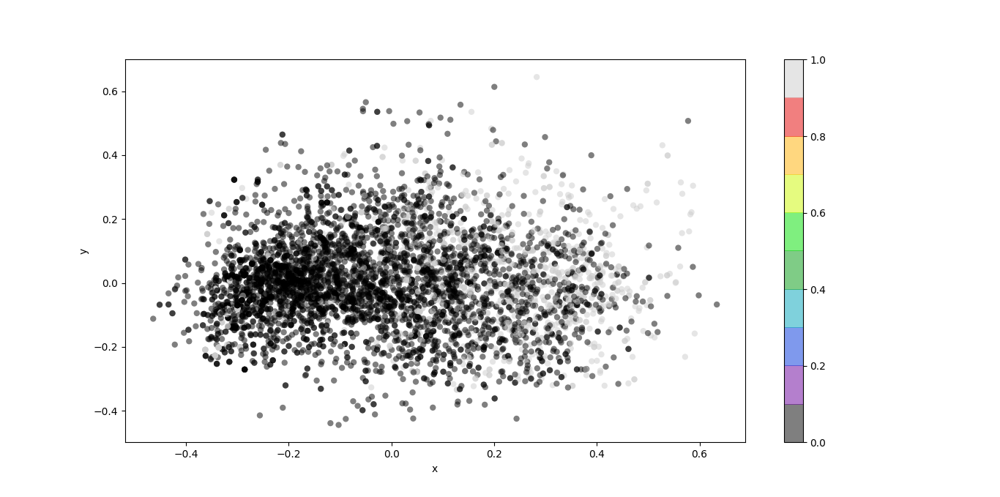
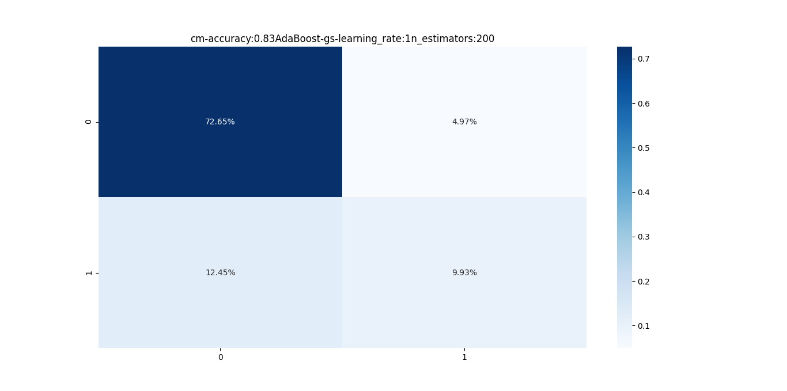
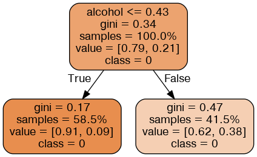
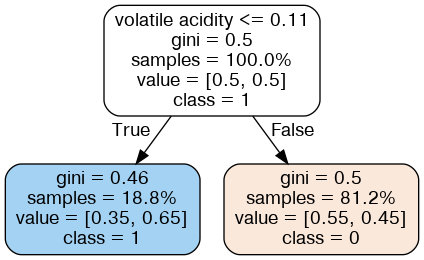
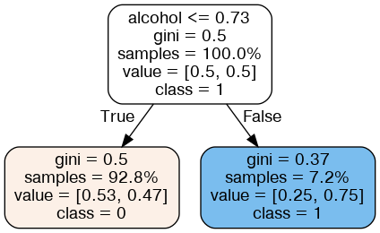

# Directory Structure
```text
.
├── api_test.py
├── app.py
├── data
│   └── wine.csv
├── docker-compose.yml
├── Dockerfile
├── figures
│   ├── Figure_cm_cm-accuracy:0.81AdaBoost-gs-learning_rate:0.3n_estimators:200.png
│   ├── Figure_cm_cm-accuracy:0.83AdaBoost-gs-learning_rate:1n_estimators:200.png
│   ├── Figure_wine.png
│   ├── wine-graph-0.png
│   ├── wine-graph-100.png
│   ├── wine-graph-1.png
│   └── wine-graph-33.png
├── graph
│   ├── wine-graph-0.dot
│   ├── wine-graph-100.dot
│   ├── wine-graph-1.dot
│   └── wine-graph-33.dot
├── README.md
├── requiremenets.txt
├── run.py
├── utils
│   ├── data.py
│   ├── __init__.py
│   ├── model.py
│   └── plot.py
└── weights
    ├── AdaBoost-gs-est-0-0xakz.pkl
    ├── AdaBoost-gs-est-0-ass2m.pkl
    ├── AdaBoost-gs-est-0-gecsl.pkl
    ├── AdaBoost-gs-est-0-nt7gd.pkl
    ├── AdaBoost-gs-est-0-pi0vv.pkl
    ├── AdaBoost-gs-est-1-5w77d.pkl
    ├── AdaBoost-gs-est-1-6m05z.pkl
    ├── AdaBoost-gs-est-1-cdol7.pkl
    ├── AdaBoost-gs-est-1-d9xh6.pkl
    ├── AdaBoost-gs-est-1-hvhp5.pkl
    ├── AdaBoost-gs-est-2-iz1y7.pkl
    ├── AdaBoost-gs-est-2-juvot.pkl
    ├── AdaBoost-gs-est-2-pnd2g.pkl
    ├── AdaBoost-gs-est-2-u1xyh.pkl
    └── AdaBoost-gs-est-2-yhsnu.pkl

5 directories, 38 files
```
# Command Line Interface
```text
usage: run.py [-h] [--load LOAD] [--gs GS]

optional arguments:
  -h, --help   show this help message and exit
  --load LOAD  True: Load trained model False: Train model default: True
  --gs GS      Find optimal parameters with 10-Fold GridSearchCV
```


# Data
```text
Features: fixed_acidity, volatile_acidity, citric_acid, residual_sugar, chlorides, free_sulfur_dioxide, total_sulfur_dioxide, density, pH, sulphates, alcohol
```
```text
Labels: 0,1      ( not Tasty Wine, Tasty Wine )
```
# Plot the Wine Train & Test data with 2D PCA


# Install Graphviz to Visualize DecisionTree
```shell
 sudo apt install graphviz
 ```


# AdaBoost Parameters
```text
n_estimators: 50, 100, 200
```
```text
learning_rate: 0.01, 0.05, 0.1, 0.3, 1
```
```text
base_estimator: DecisionTreeClassifier
```
```text
criterion: entropy
```
```text
max_features: sqrt
```

# Additional CLI parameters
```text
gs: yes,no
```
```text
load: yes,no
```

# Train the AdaBoost model

## Experiment 1

### Parameters

```text
base_estimator: DecisionTreeClassifier
```

```text
criterion: entropy
```

```text
max_features: sqrt
```
```text
n_estimators: 100
```

```text
learning_rate: 1
```

### CLI

```shell
 python run.py --load no --gs no
```

### Confusion Matrix


### Accuracy Score: 0.82

### Visualize the trained AdaBoost


## Experiment 2


### Parameters

```text
n_estimators: it's a gs work
```

```text
learning_rate: it's gs work
```
### CLI

```shell
python run.py --load no --gs yes
```

### Confusion Matrix



### Accuracy Score: 0.83

### Optimal Parameters with 10-Fold GridSearchCV

```text
n_estimators: 200
```

```text
learning_rate: 1
```
### Visualize the trained DecisionTree
```text
It gives us the Decision Stumps
```






# Load the trained model

```shell
python run.py --load yes 
```

# Docker for the model

## Build the Docker image

You can build docker image by following:

```shell
docker-compose build
```

## Run Docker container

You can launch a container from the Docker image by following:

```shell
docker-compose up
```


